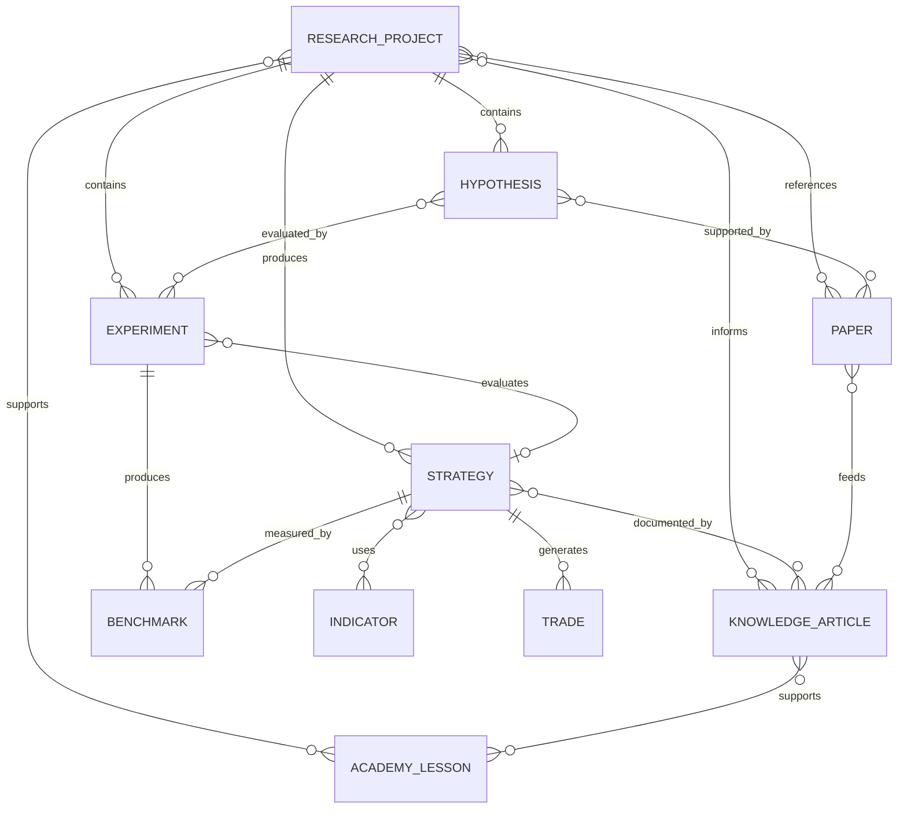

# Entity Relationship

```mermaid
erDiagram
  RESEARCH_PROJECT ||--o{ HYPOTHESIS : contains
  RESEARCH_PROJECT ||--o{ EXPERIMENT : contains
  RESEARCH_PROJECT }o--o{ PAPER : references
  RESEARCH_PROJECT ||--o{ STRATEGY : produces
  RESEARCH_PROJECT }o--o{ KNOWLEDGE_ARTICLE : informs
  RESEARCH_PROJECT }o--o{ ACADEMY_LESSON : supports

  HYPOTHESIS }o--o{ PAPER : supported_by
  HYPOTHESIS }o--o{ EXPERIMENT : evaluated_by

  EXPERIMENT }o--o| STRATEGY : evaluates
  EXPERIMENT ||--o{ BENCHMARK : produces

  STRATEGY }o--o{ INDICATOR : uses
  STRATEGY ||--o{ BENCHMARK : measured_by
  STRATEGY ||--o{ TRADE : generates
  STRATEGY }o--o{ KNOWLEDGE_ARTICLE : documented_by

  PAPER }o--o{ KNOWLEDGE_ARTICLE : feeds
  KNOWLEDGE_ARTICLE }o--o{ ACADEMY_LESSON : supports
```
